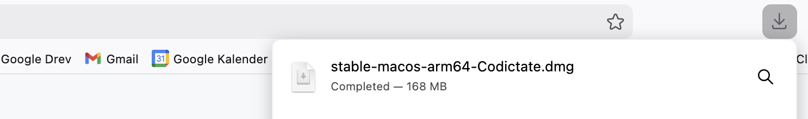
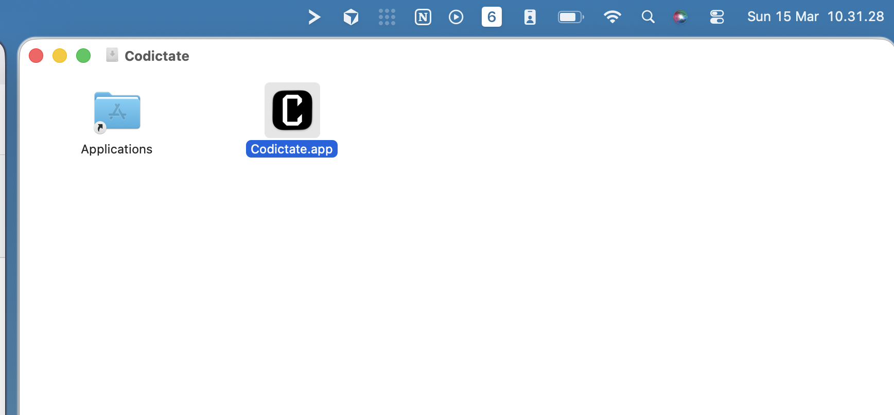
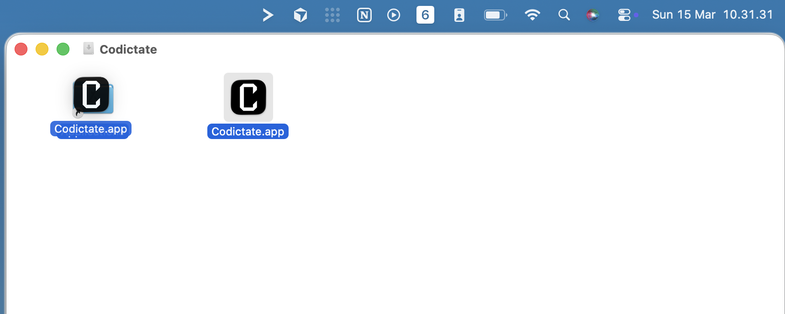
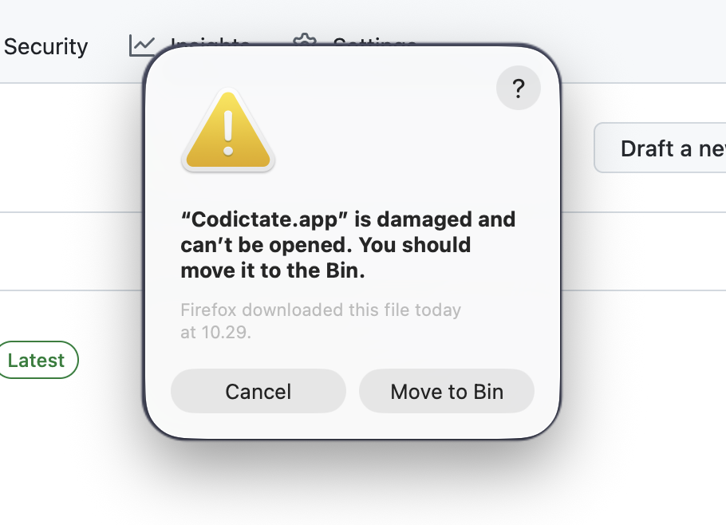
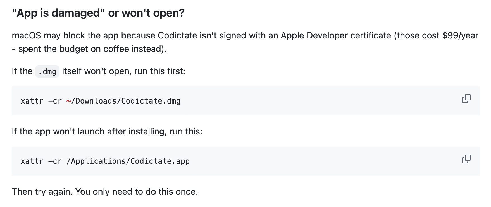
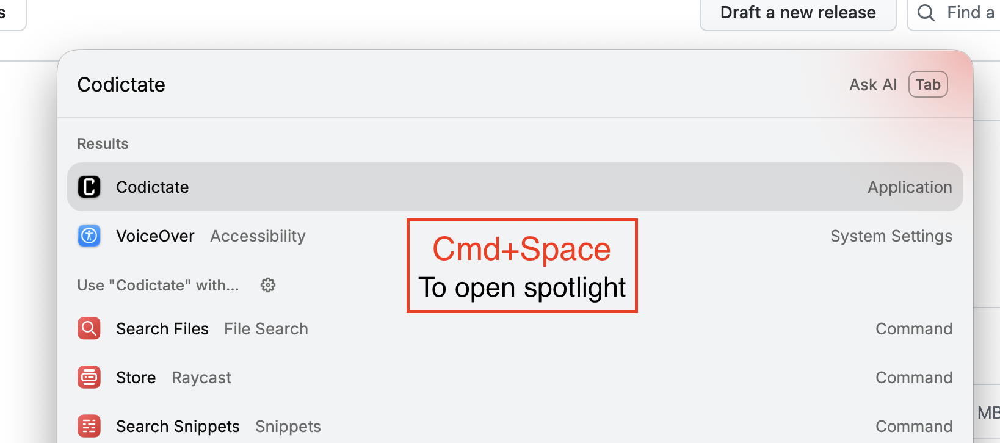
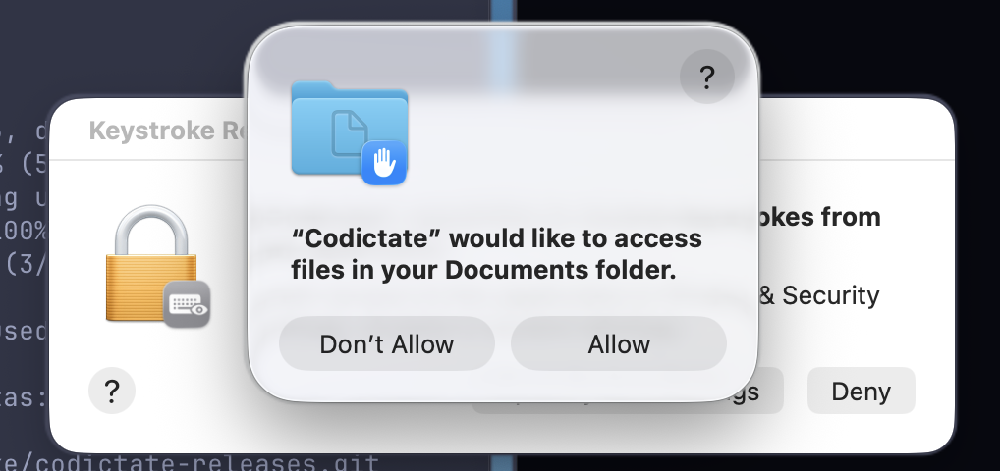
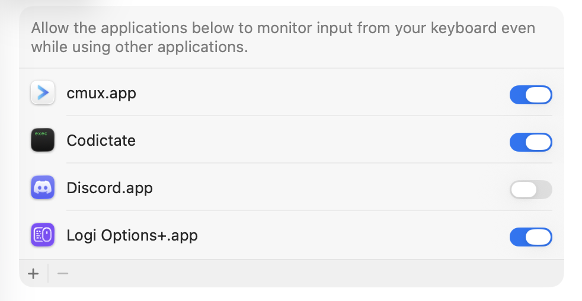
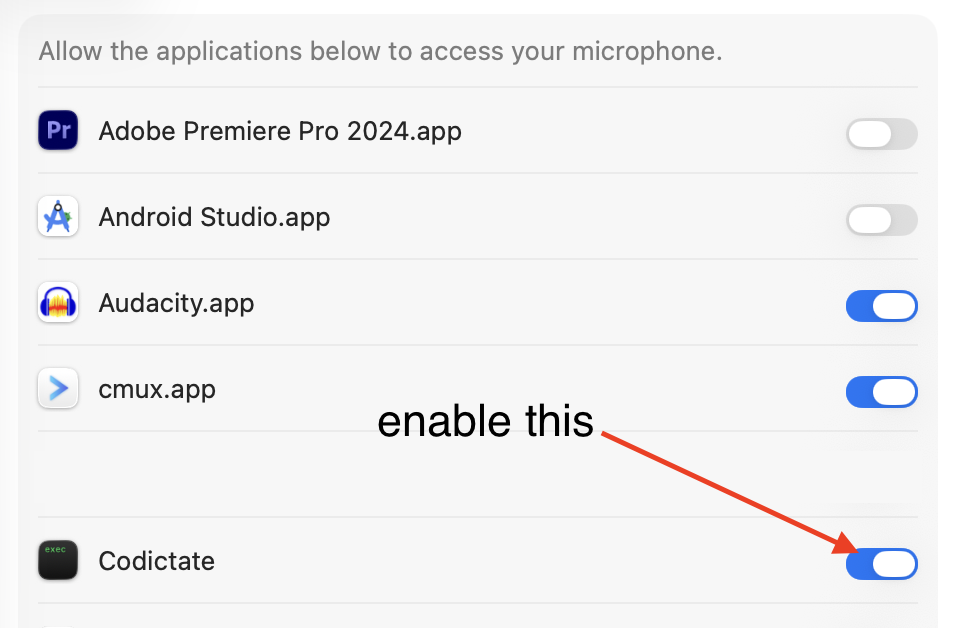

# Installation Guide

> First time installing? Follow these steps to get Codictate up and running.

---

### Step 1 - Download the DMG

Go to [Releases](https://github.com/EmilLykke/codictate/releases) and download `stable-macos-arm64-Codictate.dmg`.


---

### Step 2 - Wait for the download to complete



---

### Step 3 - Open the DMG and drag Codictate to Applications





---

### Step 4 - Try opening Codictate via Spotlight

Press `Cmd+Space` to open Spotlight and search for **Codictate**.


---

### Step 5 - macOS will say the app is damaged - press Cancel

This happens because Codictate isn't signed with an Apple Developer certificate (those cost $99/year - spent the budget on coffee instead). Don't worry, the fix is one command.



---

### Step 6 - Open Terminal via Spotlight

Press `Cmd+Space` again and search for **Terminal**.


---

### Step 7 - Run the fix command

Copy and paste this command into Terminal and press Enter:

```bash
xattr -cr /Applications/Codictate.app
```




---

### Step 8 - Open Codictate again via Spotlight

Press `Cmd+Space` and search for **Codictate** again.



---

### Step 9 - Allow access to your Documents folder

Click **Allow** when macOS asks.



---

### Step 10 - Allow Input Monitoring

Codictate needs this to detect your shortcut while other apps are in focus. Click **Open System Settings** and enable the toggle for Codictate.




The app may quit after this - that is expected. Open it again via Spotlight (`Cmd+Space` → Codictate).


---

### Step 11 - Allow Accessibility access

Codictate needs this to paste the transcribed text into other apps. Click **Open System Settings** and enable **both** Codictate entries.


---

### Step 12 - Allow Microphone access

Back in the Codictate app, click **Allow** next to Microphone. You will be taken to System Settings - enable the toggle for Codictate.




---

### Step 13 - You're ready!

Codictate is now set up. Press `Option+Space` anywhere to start recording, press it again to stop - your words will appear wherever your cursor is.


---

## Troubleshooting - Permissions

If Codictate isn't working as expected (shortcut not detected, text not pasting, etc.), the most common cause is a missing permission. Here is how to check them all in one place.

**Open System Settings → Privacy & Security**


Scroll down to the **Privacy & Security** section. You need to verify four entries:


Make sure Codictate is enabled under **all four** of these:

| Permission | What it does |
|---|---|
| **Files & Folders** | Saves recordings and transcription data |
| **Accessibility** | Pastes transcribed text into other apps |
| **Input Monitoring** | Detects your shortcut while other apps are in focus |
| **Microphone** | Records your voice |

If any of these are missing or disabled, toggle them on and relaunch Codictate.
